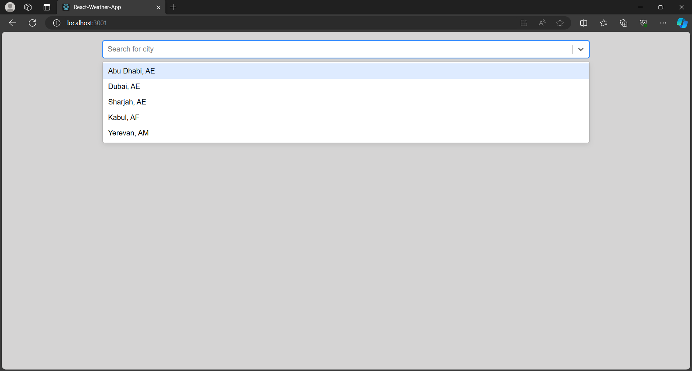
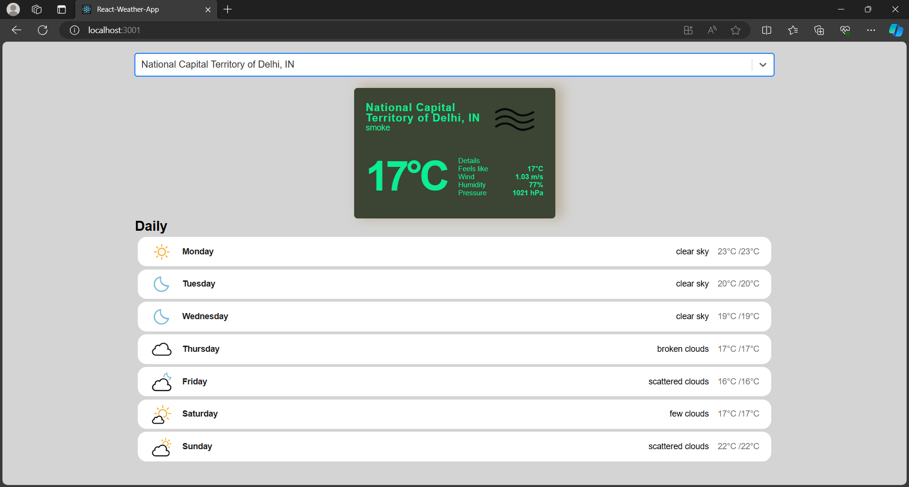
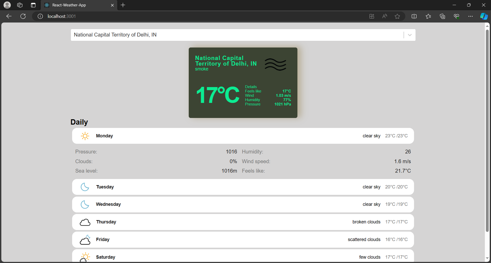

# Weather Application
## Acknowledgments

Special thanks to Slobodan Gajic and freeCodeCamp.org for the excellent step-by-step tutorial that inspired and guided the development of this project. Check out the video tutorial [here](https://www.youtube.com/watch?v=Reny0cTTv24) to learn more about the process.

## Overview

This weather application provides users with real-time weather information for locations around the world. It utilizes the OpenWeatherMap API for weather data and the GeoDB API for places autocomplete functionality.

## Features

- **Current Weather**: Get the current weather conditions for a specific location.
- **Places Autocomplete**: Provide a seamless experience for users by allowing them to easily search for locations using the GeoDB API's places autocomplete.

## Technologies Used

- **OpenWeatherMap API**: Retrieve weather data, including current weather conditions, forecasts, and more.
- **GeoDB API**: Enable places autocomplete to enhance the user experience.
- **Frontend**: React

## Images

